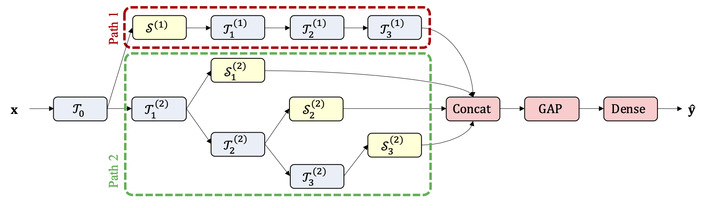

## Spectro-Spatio-Temporal EEG Representation Learning for Imagined Speech Recognition

This repository provides a TensorFlow implementation of the following paper:
> **VIGNet: A Deep Convolutional Neural Network for EEG-based Driver Vigilance Estimation** 
> [Wonjun Ko](https://scholar.google.com/citations?user=Fvzg1_sAAAAJ&hl=ko&oi=ao)1, [Eunjin Jeon](https://scholar.google.com/citations?user=U_hg5B0AAAAJ&hl=ko)1, [Heung-Il Suk](https://scholar.google.co.kr/citations?user=dl_oZLwAAAAJ&hl=ko)1, 2 
> (1Department of Brain and Cognitive Engineering, Korea University)  
> (2Department of Artificial Intelligence, Korea University)  
> [[Official version]]: TBA
> Presented in the 8th IEEE International Winter Conference on Brain-Computer Interface (BCI)
> 
